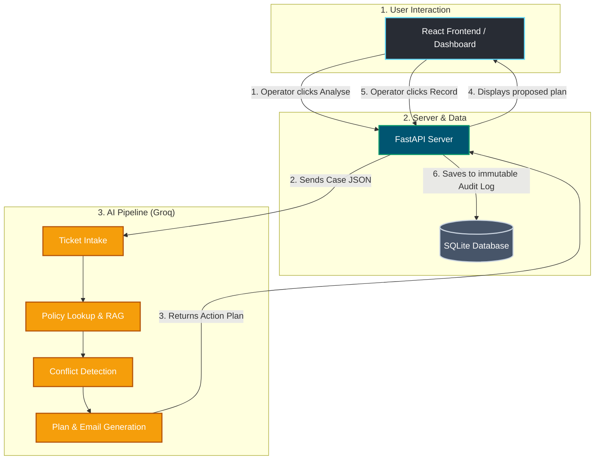

<div align="center">
DEPLOYNMENT LINK - https://chillstack-ai-production.up.railway.app/
  
# 🛠️ Chillstack ResolveDesk
**An Agentic AI Service Desk that turns 30-minute support tickets into 5-second automated resolutions.**

[](https://reactjs.org/)
[](https://fastapi.tiangolo.com/)
[](https://groq.com/)
[](https://python.org)

</div>

---

## 🚨 The Problem
In large enterprises like **Chillstack**, IT Support operators handle hundreds of tickets daily. 
When an employee requests a new laptop, an operator must manually:
1. Read the ticket.
2. Search through dozens of dense company policy documents.
3. Determine if the employee qualifies.

**The catch?** Policies change frequently, and older policies often contradict newer ones. If a human operator misses a newly updated policy, the company wastes thousands of dollars fulfilling invalid requests. 

## 💡 The Solution
**ResolveDesk** is a "Human-in-the-Loop" Agentic AI. 
Instead of a human reading the rulebooks, ResolveDesk's AI engine instantly reads the incoming ticket, cross-references it against **all** active company policies simultaneously, catches contradictions, and presents a finalized action plan to the human operator for 1-click approval.

### 🌟 Key Benefits
- ⚡ **Lightning Fast:** Reduces ticket triage time from ~25 minutes to **5 seconds**.
- 🛡️ **Conflict Detection:** Flawlessly detects contradictions between old and new company policies that humans miss.
- 🤖 **Auto-Drafting:** Automatically writes the response email to the employee explaining the policy decision.
- 🔒 **Zero-Risk Simulation:** Operates safely. Actions are simulated and recorded to an immutable SQLite audit log—no real emails or destructive actions occur without human approval.

---

## 🏗️ Architecture & Pipeline

ResolveDesk is built on a modern, decoupled **3-Tier Architecture**:

### 1. The React Dashboard (Frontend)
A premium, dark-mode workspace built with **Vite + React**. It provides operators with a sleek interface to view cases, read policies, and review the AI's proposed synthesis.

### 2. The FastAPI Server (Backend)
A high-performance REST API built with **Python & FastAPI**. It acts as the bridge, exposing the AI engine to the React frontend.

### 3. The Agentic Core (AI Engine)
The brain of the operation. Powered by the **Groq API**, it follows a strict deterministic pipeline:
* **Intake:** Parses the incoming JSON employee request.
* **Retrieval (RAG):** Searches the `policies.json` database for relevant rules.
* **Synthesis:** The LLM evaluates the request against the rules, detects conflicts, and formulates a plan.
* **Safety Fallback:** If the API fails, a deterministic Python `rules.py` engine takes over to guarantee a safe response.

### 🔄 Project Flow Chart



---

## 💻 Tech Stack

| Layer | Technology | Purpose |
|---|---|---|
| **Frontend** | React, Vite, Vanilla CSS | Premium, responsive operator workspace. |
| **Backend** | FastAPI, Uvicorn | Blazing fast RESTful API server. |
| **AI / Logic** | Groq API, Python 3.10+ | Ultra-fast LLM inference and offline rule engine. |
| **Database** | SQLite | Immutable, local storage for audit logs and state. |

---

## 🚀 Quick Start Guide

### 1. Prerequisites
- **Node.js** (v18+)
- **Python** (v3.10+)

### 2. Environment Setup
Create a `.env` file in the root directory and add your Groq API key:
```ini
GROQ_API_KEY=gsk_your_api_key_here
GROQ_MODEL=openai/gpt-oss-120b
```

### 3. One-Click Launch (Windows)
If you are on Windows, simply run the included PowerShell startup script from the project root:
```powershell
./start.ps1
```
*This will automatically launch the FastAPI backend on port 8000 and the React frontend on port 5173.*

### 4. Manual Launch
**Terminal 1 (Backend):**
```bash
python -m venv venv
venv\Scripts\activate
pip install -r requirements.txt
uvicorn backend.main:app --reload --port 8000
```

**Terminal 2 (Frontend):**
```bash
cd frontend
npm install
npm run dev
```

---

<div align="center">
  <i>Built for the modern IT Service Desk.</i>
</div>
